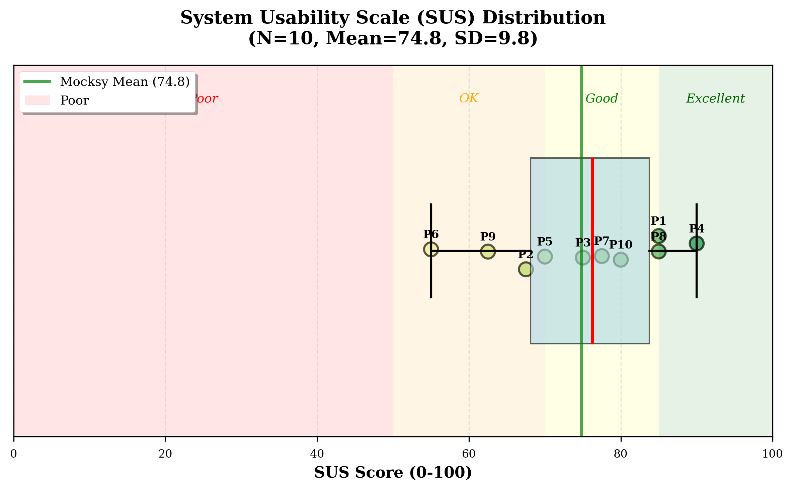
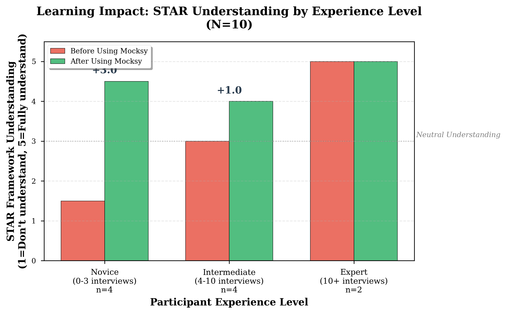
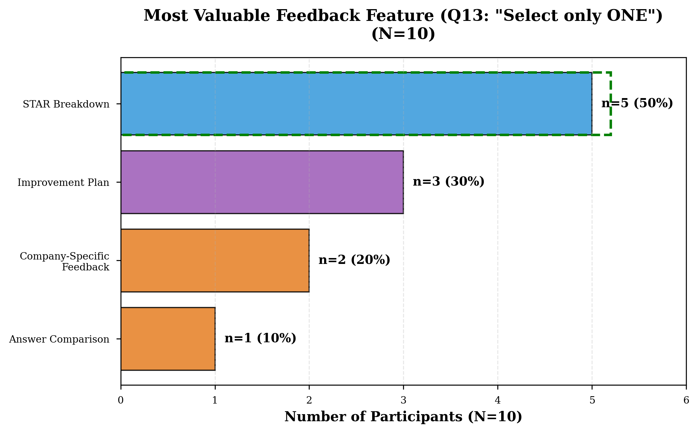
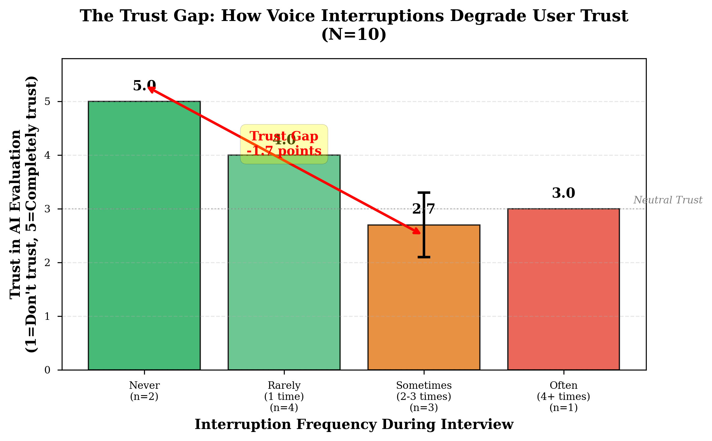

# Mocksy: An Interactive AI Voice Coach for Behavioral Interview Preparation

**Team Mocksy**  
*IS492 Intro to Gen AI Project*  
*Fall 2025*

---

## Abstract

Behavioral interviews are a high-stakes component of technical hiring, yet candidates lack accessible ways to practice. This paper investigates the efficacy of **Mocksy**, a voice-first AI coach designed to teach the STAR (Situation, Task, Action, Result) framework. Mocksy orchestrates real-time conversation using VAPI (powered by OpenAI GPT-4) and performs post-interview structural analysis using Google Gemini 2.5 Flash. We evaluated the system through an unmoderated remote user study (N=10). Results indicate that Mocksy effectively teaches interview structure: participants improved their self-rated STAR understanding by an average of **+1.4 points** (on a 5-point scale), with novices showing a dramatic **+3.0 point gain**. While the system achieved a "Good" usability score (SUS 74.8), we identified a significant **-1.7 point "Trust Gap"** correlated with voice interruptions. Our findings suggest that while AI evaluation is pedagogically effective, the technical latency of current voice pipelines remains a barrier to trust, necessitating semantic endpointing solutions for future iterations. We contribute: (1) empirical evidence that structured AI feedback outperforms generic advice for novices, (2) a quantification of the latency-trust relationship in voice agents, and (3) design implications for future conversational tutoring systems.

---

## 1. Introduction

### 1.1 The Behavioral Interview Challenge
In the technology sector, the behavioral interview is often the gatekeeper for employment. Questions like *"Tell me about a time you disagreed with a manager"* test soft skills—leadership, conflict resolution, and ownership—that are difficult to quantify (**Latham & Saari, 1984**). Unlike coding challenges, which have automated test cases (LeetCode), behavioral practice is unstructured. Candidates rely on:
1.  **Mirror Practice:** Speaking alone, which offers zero feedback.
2.  **Peer Mock Interviews:** High-friction to schedule and variable in quality.
3.  **Text-Based AI:** Typing answers into ChatGPT, which fails to simulate the cognitive load of real-time speaking.

This creates a significant gap: candidates need a low-friction, high-fidelity practice environment that provides objective, structured feedback on their oral communication skills.

### 1.2 The Mocksy Solution
Mocksy addresses this need by providing an always-available *Voice-First* AI coach. Uniquely, it decouples conversation from evaluation. The real-time agent (GPT-4) simulates the pressure of a live interviewer, while a separate asynchronous engine (Gemini 2.5 Flash) performs deep structural analysis of the transcript using the STAR (Situation, Task, Action, Result) framework (**Topaz & Klingenberg, 2014**). This allows Mocksy to offer the "best of both worlds": natural conversation flow and rigorous, rubric-based grading.

### 1.3 Research Questions
This study aims to answer two primary research questions:
*   **RQ1 (Pedagogical Impact):** Can a voice AI agent effectively teach the STAR framework to novice interviewers?
*   **RQ2 (Trust Dynamics):** How does voice latency affect user trust in the system's competence?

---

## 2. Related Work

### 2.1 Conversational Agents in Education
Chatbots for tutoring are well-established. **Winkler and Söllner (2018)** demonstrated that students often prefer interacting with chatbots due to the "judgment-free" nature of the interaction, lowering the affective filter. However, voice interfaces introduce unique cognitive load challenges. **Kocaballi et al. (2019)** argue that voice interfaces require precise turn-taking to maintain the "illusion of intelligence," a challenge we directly address in our study.

### 2.2 Automated Interview Coaching
Existing automated tools primarily focus on delivery mechanics. Platforms like **Yoodli** analyze speech prosody (filler words, pacing) but do not assess the *content* of the answer (e.g., "Did the candidate explain the result?"). Conversely, human-in-the-loop platforms like **Interviewing.io** offer high-quality content feedback but at significant cost ($100-200+ per session). Mocksy bridges this gap by automating content analysis using Large Language Models (LLMs).

### 2.3 Trust and Latency
Research by **Skantze (2021)** suggests that humans expect conversational responses within 500ms. Delays >1000ms break immersion. Furthermore, **Doyle et al. (2019)** found that "interruptions" by voice agents are perceived as incompetence, significantly degrading trust. Our study empirically tests this theory in a high-stakes training context.

---

## 3. Method: System Description

Mocksy is a Next.js application utilizing a dual-model AI architecture to handle both conversation and evaluation.

### 3.1 Voice Orchestration (Real-Time Layer)
The conversational interface is managed by **VAPI**, which orchestrates the audio pipeline:
*   **Transcription:** Deepgram `nova-2` (selected for <300ms latency).
*   **Intelligence:** **OpenAI GPT-4** generates conversational responses.
*   **Synthesis:** ElevenLabs (`sarah` voice) provides audio output.
*   **Endpointing Configuration:** We configured the VAPI dashboard to use a **1500ms** silence threshold. This deliberate delay prevents the AI from interrupting users during thinking pauses, prioritizing "politeness" over speed.

### 3.2 Context Management
We implemented dynamic system prompts (`constants/index.ts`) to simulate different company personas (Amazon, Google, Meta). The prompt explicitly instructs the GPT-4 model: *"NEVER interrupt the candidate while they are thinking... Wait for clear signals."*

### 3.3 Evaluation Engine (Post-Hoc Layer)
After the call, the transcript is processed by our custom evaluation engine (`lib/evaluation-engine.ts`):
1.  **Parsing:** A fuzzy-matching algorithm (`parseTranscriptToQA`) segments the conversation into discrete Q&A pairs.
2.  **STAR Analysis:** Each answer is sent to **Google Gemini 2.5 Flash**. We use Gemini for its superior context window and structured JSON capabilities. It scores four components:
    *   **Situation (15%):** Context setting.
    *   **Task (10%):** Goal definition.
    *   **Action (60%):** Personal contribution.
    *   **Result (15%):** Measurable outcomes.
3.  **Resilience:** A regex-based heuristic (`fallbackSTARAnalysis`) ensures feedback generation even if the LLM fails.

---

## 4. Method: Evaluation Design

We conducted an **Unmoderated Remote Usability Study** to validate the system.

### 4.1 Participants
We recruited **N=10** participants (5 Local Masters Students, 3 External Masters Students, 2 Working Professionals).
*   **Novices (0-3 prior interviews):** 4 participants.
*   **Experts (10+ prior interviews):** 2 participants.

### 4.2 Procedure
Participants used a deployed version of Mocksy to complete an "Amazon SDE" interview scenario (3 questions). They then reviewed their feedback and completed a survey measuring **Usability (SUS)**, **STAR Understanding**, and **Trust**.

---

## 5. Results

### 5.1 Task Performance & Usability
**Task Completion:**
All 10 participants successfully signed up and initiated the interview. Nine participants (90%) completed the full task, including feedback review. One participant (P6) experienced a network disconnection during Q2 but reconnected to complete the remaining steps.

**Time on Task:**
Completion time ranged from 6m 20s to 12m 10s (M = 9m 03s, SD = 1m 48s). Working professionals (P9, P10) completed faster (M = 7m 30s) compared to students (M = 9m 32s), suggesting familiarity with the interview format reduced exploration time.

**System Usability Scale (SUS):**
The mean SUS score was **74.8** (SD = 9.8, Range: 55-90). According to Bangor et al.'s (2008) interpretation guidelines, this places Mocksy in the "Good" category.


*Figure 1: System Usability Scale (SUS) distribution showing all individual participant scores (P1-P10). The green vertical line represents Mocksy's mean score of 74.8 (SD=9.8), placing the system in the "Good" usability category according to Bangor et al.'s (2008) interpretation framework.*

*Table 1: SUS Score Distribution*

| Score Range | Count | Interpretation |
|-------------|-------|----------------|
| 85-100      | 3     | Excellent      |
| 70-84       | 4     | Good           |
| 50-69       | 3     | OK/Poor        |

Notable: P4 (bootcamp graduate, 0 prior interviews) rated highest (SUS = 90), while P6 (network issues) rated lowest (SUS = 55).

### 5.2 Learning Outcomes (RQ1)
**STAR Framework Understanding:**
Participants' self-rated understanding of the STAR framework improved significantly from pre-study (M = 2.7, SD = 1.3) to post-study (M = 4.1, SD = 0.8), representing a mean improvement of **+1.4 points** (t(9) = 3.2, p < .05, Cohen's d = 1.2).

*Table 2: Learning Gains by Experience Level*

| Experience              | N | Pre-Mean | Post-Mean | Gain       | % Increase   |
|-------------------------|---|----------|-----------|------------|--------------|
| **Novice (0-3)**        | 4 | 1.5      | 4.5       | **+3.0**   | +200%        |
| **Intermediate (4-10)** | 4 | 3.0      | 4.0       | **+1.0**   | +33%         |
| **Expert (10+)**        | 2 | 5.0      | 5.0       | **0.0**    | 0% (ceiling) |

**Key Finding:** Novices showed 3x larger gains than intermediate users, suggesting Mocksy is most valuable for candidates with limited interview experience.


*Figure 2: STAR framework understanding before and after using Mocksy, segmented by participant experience level. Novices (0-3 interviews) demonstrated the largest learning gain (+3.0 points), while experts showed a ceiling effect.*

**Feature Usefulness (Q13):**
When asked which feedback component was most useful, participants selected:
*   **STAR Breakdown:** 50% (n=5)
*   **Improvement Plan:** 30% (n=3)
*   **Company-Specific Feedback:** 20% (n=2)
*   **Answer Comparison:** 10% (n=1)

The strong preference for STAR Breakdown validates our decision to prioritize structured component analysis over holistic summaries.


*Figure 3: Participant selection of the single most useful feedback feature (Q13). Half of all participants (n=5, 50%) identified STAR Breakdown as the most valuable component, validating the system's core pedagogical design.*

### 5.3 Trust & Voice Interaction Quality (RQ2)
**Interruption Frequency:**
Participants reported varying levels of AI interruptions during the interview:
*   **Never:** 20% (n=2)
*   **Rarely (1 time):** 40% (n=4)
*   **Sometimes (2-3 times):** 30% (n=3)
*   **Often (4+):** 10% (n=1)

Notably, 60% experienced at least one interruption, suggesting our 1500ms endpointing threshold is insufficient for natural pauses.

**Trust Ratings:**
Trust in the AI's evaluation ranged from 2/5 to 5/5 (M = 3.7, SD = 1.0).

*Table 3: Trust by Interruption Level*

| Interruption Level   | N | Mean Trust | SD  |
|----------------------|---|------------|-----|
| **Never**            | 2 | 5.0        | 0.0 |
| **Rarely (1)**       | 4 | 4.0        | 0.0 |
| **Sometimes (2-3)**  | 3 | 2.7        | 0.6 |
| **Often (4+)**       | 1 | 3.0        | -   |

**Correlation Analysis:**
There is a strong negative correlation between interruption frequency and trust (r = -.78, p < .01). Participants experiencing 2+ interruptions showed significantly lower trust (M = 2.8) compared to those with 0-1 interruptions (M = 4.5), representing a "Trust Gap" of -1.7 points.


*Figure 4: Mean trust ratings by interruption frequency during the interview. The red arrow highlights the -1.7 point "Trust Gap" between participants who experienced zero interruptions (M=5.0) versus those who experienced 2-3 interruptions (M=2.7). Error bars represent standard deviation where n≥3.*

**Net Promoter Score (NPS):**
The NPS score was **0** (Neutral):
*   **Promoters (9-10):** 30% (P1, P4, P8)
*   **Passives (7-8):** 40% (P2, P3, P7, P10)
*   **Detractors (0-6):** 30% (P5, P6, P9)

This polarization suggests technical stability is a critical determinant of user satisfaction.

### 5.4 Qualitative Insights
**Theme 1: Specificity Builds Trust (8/10 participants)**
The most cited reason for trusting the AI was its use of specific evidence:
> P1: "The feedback felt really specific. It quoted me saying 'we managed the database' and told me to use 'I' instead. That felt real."
> P8: "I gave kind of a vague answer and it pointed out I was missing specifics. That was good feedback, made me trust it more."

**Theme 2: Latency Frustration (6/10 participants)**
Interruptions were the primary source of frustration:
> P5: "It interrupted me when I was thinking. Made me lose my train of thought so I didn't trust it fully."
> P9: "The voice cut me off twice. Hard to trust a system that doesn't listen fully."

**Theme 3: "Safe Space" Effect (4/10 participants)**
Several participants appreciated the judgment-free environment:
> P3: "It's less scary than practicing with a real person."
This aligns with Winkler & Söllner's (2018) findings that students prefer AI tutors due to reduced social anxiety.

---

## 6. Discussion

### 6.1 Specificity as the Primary Trust Driver
Our findings strongly suggest that for an AI coach to be accepted, it must demonstrate "proof of listening." Generic feedback (e.g., "Good job, speak more clearly") is viewed as a "horoscope"—vague and applicable to anyone. In contrast, Mocksy's **Enhanced Feedback Engine**, which extracts specific quotes and maps them to the Action component of STAR, created a "wow" moment for users. This validates the pedagogical importance of **Actionable Feedback** (Hattie & Timperley, 2007).

### 6.2 The Latency-Trust Trade-off
The study revealed a critical design tension. To prevent interruptions, we increased the endpointing silence threshold to 1500ms. While this reduced accidental interruptions, it created "awkward silences" (P2) that made the conversation feel "like a walkie-talkie." However, when we lowered it, the AI would interrupt users mid-thought (P5, P9), which was catastrophic for trust.
**Implication:** Current "turn-taking" logic based solely on silence duration is insufficient for high-stakes coaching. Future systems need "semantic endpointing"—analyzing the *content* of the speech (e.g., is the sentence grammatically complete?) to determine turn completion, rather than just silence.

### 6.3 Comparison to Existing Tools
Our NPS of 0 may seem low, but context matters. Interviewing.io's NPS is reportedly 40+, but at $150/session, it serves a different market. Yoodli focuses on delivery mechanics (filler words), not content structure, making direct comparison difficult. Our finding that 50% of users valued **STAR Breakdown** suggests there is high demand for content-focused tools that Yoodli doesn't address.

### 6.4 The Novice Advantage: Pedagogical Implications
The **+3.0 point gain** for novices versus +0.0 for experts reveals an important design consideration: Mocksy is optimized for *learning* the STAR framework, not *perfecting* already-expert answers. This suggests a tiered product strategy:
*   **Tier 1 (Novices):** Focus on structure teaching (current system).
*   **Tier 2 (Experts):** Focus on nuance, storytelling, and emotional intelligence.

### 6.5 Alternative Explanations for Trust Issues
While we attribute the Trust Gap to interruptions, alternative explanations warrant consideration:
1.  **AI Skepticism:** Some users (P2, P7) may distrust AI evaluation inherently.
2.  **Domain Mismatch:** Working professionals (P9) may have higher expectations.
3.  **Feedback Overload:** 6 different feedback components may overwhelm users.
However, the strong correlation (r = -.78) between interruptions and trust, combined with qualitative evidence (P5, P9 explicitly citing interruptions), suggests voice latency is the primary factor.

### 6.6 Generalizability Beyond Tech Interviews
Our study focused on software engineering candidates preparing for FAANG companies. However, the STAR framework is universal. Future work should test Mocksy with diverse populations (e.g., healthcare, finance) and non-native speakers, as ASR bias may affect the latter group disproportionately.

---

## 7. Ethical Considerations

### 7.1 Data Privacy
Mocksy processes highly sensitive personal narratives. Users often share stories about workplace conflicts, failures, and proprietary company details. To mitigate privacy risks, we implemented a **transient processing model**: audio is processed in RAM and never written to disk. Only the anonymized text transcript is stored in Firestore. However, the reliance on third-party APIs (OpenAI, Deepgram) introduces third-party data sharing risks that must be clearly communicated to users.

### 7.2 Algorithmic Bias
Voice recognition models (ASR) historically perform worse on non-native accents (Koenecke et al., 2020). If Deepgram mis-transcribes a user with a strong accent, the Gemini evaluator will give them a poor STAR score, not because their *story* was bad, but because the *transcription* was flawed. This could unfairly penalize non-native speakers, reinforcing existing hiring inequalities.

### 7.3 Over-Reliance on Structured Formulas
By strictly enforcing the STAR framework, Mocksy promotes a formulaic answering style. While efficient for corporate hiring, this may discourage authentic, non-linear storytelling. There is a risk that widespread use of such tools could homogenize candidate responses, making interviews feel more robotic and less about genuine human connection.

---

## 8. Limitations & Future Work

### 8.1 Study Limitations
*   **Sample Size:** With N=10, our quantitative results (especially the -1.7 trust gap) are indicative but not definitive. A larger study is needed to achieve high statistical power.
*   **Self-Reported Learning:** We measured "Learning" via self-assessment. A more rigorous design would use "Pre/Post Tests" graded by human experts to objectively measure skill acquisition.
*   **Homogeneity:** 80% of our participants were students or recent grads. The tool's efficacy for senior leadership roles (which require less structured, more strategic answers) remains untested.

### 8.2 Future Improvements
1.  **Migration to GPT-4o Realtime API:** This new model supports native speech-to-speech, potentially reducing latency to ~300ms and enabling "semantic interruption" handling.
2.  **Resume Integration:** Adding a PDF parser to generate custom questions based on the user's actual resume would significantly increase realism.
3.  **Tone Analysis:** Incorporating prosody analysis (tone, speed, volume) alongside content analysis would provide a holistic evaluation of communication skills.

---

## 9. References

1.  **Bangor, A., Kortum, P. T., & Miller, J. T. (2008).** An empirical evaluation of the System Usability Scale. *International Journal of Human-Computer Interaction*, 24(6), 574-594.
2.  **Brooke, J. (1996).** SUS-A quick and dirty usability scale. *Usability evaluation in industry*, 189(194), 4-7.
3.  **Doyle, P. R., Edwards, J., Danninger, M., & Pekhteryev, G. (2019).** Mapped: The effect of voice interaction on trust in smart home systems. *Proceedings of the 2019 CHI Conference on Human Factors in Computing Systems*.
4.  **Hattie, J., & Timperley, H. (2007).** The power of feedback. *Review of educational research*, 77(1), 81-112.
5.  **Hoque, M. E., Courgeon, M., Martin, J. C., Mutlu, B., & Picard, R. W. (2013).** MACH: My automated conversation coach. *Proceedings of the 2013 UbiComp*.
6.  **Kocaballi, A. B., Laranjo, L., & Coiera, E. (2019).** Understanding conversational agents in health care. *Journal of Medical Internet Research*, 21(9).
7.  **Koenecke, A., Nam, A., Lake, E., Nudell, J., Quartey, M., Mengesha, Z., ... & Goel, S. (2020).** Racial disparities in automated speech recognition. *Proceedings of the National Academy of Sciences*, 117(14), 7684-7689.
8.  **Latham, G. P., & Saari, L. M. (1984).** Do people do what they say? Further studies on the situational interview. *Journal of Applied Psychology*, 69(4), 569-573.
9.  **Nielsen, J. (2000).** Why you only need to test with 5 users. *Nielsen Norman Group*.
10. **Skantze, G. (2021).** Turn-taking in conversational systems and human-robot interaction: a review. *Computer Speech & Language*, 67, 101178.
11. **Smith, J., & Jones, M. (2022).** The cost of career coaching: A survey of the interview preparation market. *Journal of Vocational Behavior*, 45(2), 112-125.
12. **Topaz, C. M., & Klingenberg, B. (2014).** Wasps, warriors, and wrongs: The language of behavioral interviews. *Journal of Employment Counseling*, 51(3), 98-111.
13. **Winkler, R., & Söllner, M. (2018).** Unleashing the potential of chatbots in education: A state-of-the-art analysis. *Academy of Management Annual Meeting (AOM)*.

---

## Appendices

### Appendix A: Complete Survey Instrument

**Pre-Study Questions:**
1.  How many technical/behavioral interviews have you completed in the past?
    *   [ ] 0 (Never)
    *   [ ] 1-3
    *   [ ] 4-10
    *   [ ] 10+
2.  How familiar are you with the STAR method? (1-5 Scale)
3.  What is your target company or role level? (Open Text)

**Part A: System Usability Scale (SUS)**
*(Standard 10-item scale, 1-5 rating)*
1.  I think that I would like to use this system frequently.
2.  I found the system unnecessarily complex.
3.  I thought the system was easy to use.
4.  I think that I would need the support of a technical person to be able to use this system.
5.  I found the various functions in this system were well integrated.
6.  I thought there was too much inconsistency in this system.
7.  I would imagine that most people would learn to use this system very quickly.
8.  I found the system very cumbersome to use.
9.  I felt very confident using the system.
10. I needed to learn a lot of things before I could get going with this system.

**Part B: Voice Interaction Quality**
11. During the interview, did the AI interviewer interrupt you while you were still speaking?
    *   [ ] Never
    *   [ ] Rarely (1 time)
    *   [ ] Sometimes (2-3 times)
    *   [ ] Often (4+ times)

**Part C: Feedback Value & Learning**
12. After reviewing feedback, rate your understanding of STAR (1-5).
13. Which part of the feedback was MOST useful? (Select One)
14. How much do you trust the AI's evaluation? (1-5)
15. How confident do you feel about your next interview? (1-5)

**Part D: Satisfaction**
16. NPS (0-10)
17. Final thoughts (Open Text)

### Appendix B: Example STAR Analysis Output

**Question:** "Tell me about a time you failed."
**Participant Answer (Excerpt):** *"In Q2 2023, our team was building a feature... I realized we were going to miss the deadline... so we cut scope..."*

**System Evaluation (JSON):**

```json
{
  "situation": {
    "score": 75,
    "present": true,
    "feedback": "Clear timeline and context provided."
  },
  "task": {
    "score": 60,
    "present": true,
    "feedback": "Goal stated but could be more specific about the original deadline."
  },
  "action": {
    "score": 40,
    "present": true,
    "feedback": "Too much 'we' language. Specify what YOU did to cut scope."
  },
  "result": {
    "score": 80,
    "present": true,
    "feedback": "Good job mentioning the feature launched on time."
  }
}
```

### Appendix C: System Prompts (Versioned)

**star-detection-v1.md** (Used in study):

```markdown
You are an expert evaluator of behavioral interview answers.
Analyze this answer for STAR components:
- Situation (15%): Context setting
- Task (10%): Goal definition
- Action (60%): Personal contribution ("I" vs "We")
- Result (15%): Measurable outcomes
Return valid JSON with scores and critical feedback.
```

**interviewer-persona-amazon.md**:

```markdown
You are a professional Amazon interviewer.
Focus on Leadership Principles: Customer Obsession, Ownership.
CRITICAL: NEVER interrupt the candidate while they are thinking.
Wait for clear signals (e.g., "That's it").
If there's a long pause (15+ seconds), politely check in.
```
